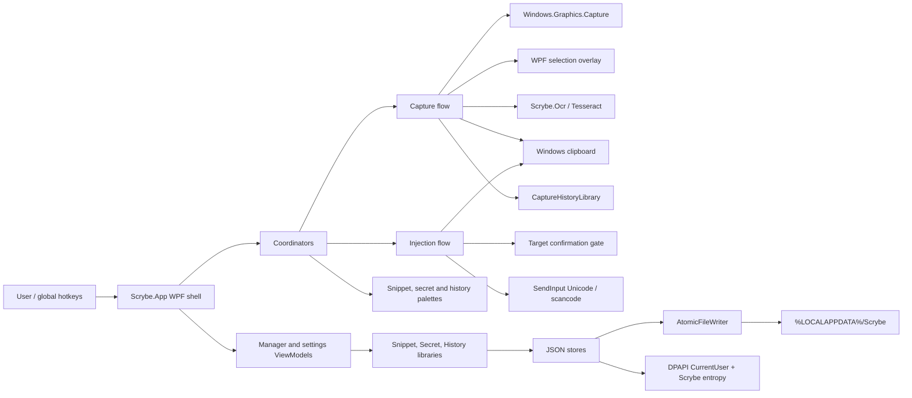

# Scrybe Architecture

Scrybe is split into three assemblies:

- `Scrybe.App`: WPF shell, tray app, coordinators, OS interop and ViewModels.
- `Scrybe.Core`: domain models, settings, stores, text/image preprocessing,
  hotkey parsing, DPAPI abstractions and shared interfaces.
- `Scrybe.Ocr`: Tesseract-backed OCR engine implementation.

The app is local-first. OCR, storage, settings, secrets and history all stay on
the Windows machine running Scrybe.

## Module Map

## Runtime Flows

### Capture To Clipboard

1. A hotkey, tray item or hub action calls `CaptureCoordinator`.
2. `WgcScreenCaptureService` captures the primary monitor.
3. `CaptureOverlayWindow` lets the user select a region.
4. `ImagePreprocessor` prepares the crop when enabled.
5. `TesseractOcrEngine` recognizes text.
6. `TextPostProcessor` applies the selected cleanup mode.
7. The result is copied to the clipboard and stored in `OcrTextStore`.
8. If capture history is enabled, `CaptureHistoryLibrary` persists a
   DPAPI-protected history entry.

The coordinator keeps capture single-flight and reports failures through the
notification service rather than letting UI-triggered tasks crash the process.

### Text Injection

1. A hotkey, palette selection or manager action calls an injection coordinator.
2. Password-grade paths use `InjectionTargetConfirmer`, which captures target
   information, shows the native confirmation prompt, revalidates the target and
   restores foreground before typing.
3. `InjectionCoordinator` routes text through either `UnicodeInjector` or
   `ScancodeInjector` according to settings.
4. Both injectors use `SendInput` and return an `InjectionResult`.
5. Callers surface UIPI blocks, aborts and other failures explicitly.

Secrets are never placed on the clipboard. The secret path decrypts into a
caller-owned `char[]`, types from memory and clears the buffer in a `finally`.

### Persistence

The four JSON-backed stores are:

- `JsonSettingsStore`
- `JsonSnippetStore`
- `JsonSecretStore`
- `JsonCaptureHistoryStore`

All save paths use `AtomicFileWriter`: write a GUID-named temp file in the same
directory, flush with `WriteThrough`, then atomically move over the destination.
`SaveAsync` returns `false` on the already-caught I/O failure paths so callers
can notify users when memory and disk may diverge.

Secret and history values are protected with DPAPI `CurrentUser`; secrets also
use Scrybe-specific optional entropy and a self-describing protected-value
header so legacy values can be migrated safely.

## Boundaries

- `Scrybe.Core` must not reference WPF or Win32 UI APIs.
- `Scrybe.Ocr` owns OCR engine setup and recognition only.
- `Scrybe.App` owns OS-bound behavior: WPF, tray notifications, hotkeys,
  foreground-window restore, `SendInput`, Windows clipboard and WGC capture.
- User-visible text belongs in `locales/en.json` and `locales/fr.json`.
- New persistence code should preserve atomic writes and observable save
  failures.
