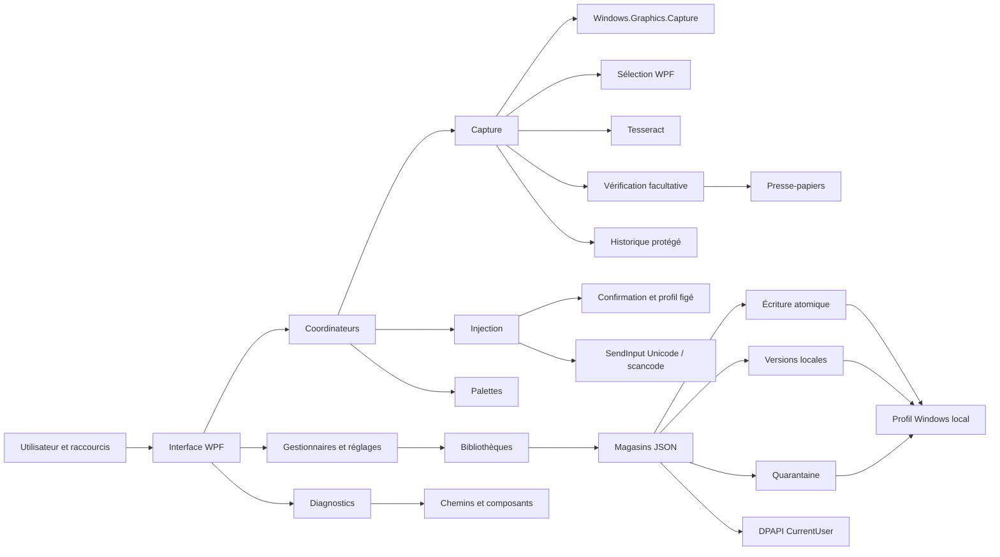

# Architecture de Scrybe

[English](../architecture.md)

Scrybe comprend trois assemblies :

- `Scrybe.App` : interface WPF, zone de notification, coordinateurs,
  interopérabilité Windows et modèles de vue.
- `Scrybe.Core` : modèles métier, réglages, magasins, prétraitement du texte
  et des images, raccourcis, protection DPAPI et interfaces partagées.
- `Scrybe.Ocr` : moteur OCR fondé sur Tesseract.

L'OCR, les réglages, les secrets et l'historique restent sur la machine Windows
qui exécute Scrybe.

## Carte des modules

## Parcours d'exécution

### Capture vers le presse-papiers

1. Un raccourci, le menu de notification ou le centre de contrôle appelle
   `CaptureCoordinator`.
2. `WgcScreenCaptureService` capture le moniteur sous le curseur.
3. `CaptureOverlayWindow` permet de sélectionner une région.
4. `ImagePreprocessor` prépare la capture si cette option est activée.
5. `TesseractOcrEngine` reconnaît le texte.
6. `TextPostProcessor` applique le nettoyage sélectionné.
7. La fenêtre facultative `OcrReviewWindow` affiche la capture et un brouillon.
   `CapturePublication` ne publie que le texte accepté dans le presse-papiers
   et `OcrTextStore`. Annuler conserve les valeurs précédentes.
8. Si l'historique est activé, `CaptureHistoryLibrary` enregistre le texte
   protégé par DPAPI.

Le coordinateur n'autorise qu'une capture à la fois et signale les erreurs par
notification. `KeyboardSelection` calcule les déplacements et dimensions
bornés en pixels physiques. L'interface convertit en DIP et annonce les
coordonnées via une région dynamique polie. Les modes brut et code conservent
les espaces en début et fin de texte.

### Injection de texte

1. Un raccourci, une palette ou un gestionnaire appelle un coordinateur.
2. `InjectionTargetConfirmer` capture l'identité de la cible, résout le profil
   correspondant exactement au nom du processus et fige le mode et les délais.
   Il affiche la confirmation native, revérifie la cible puis restaure le premier
   plan.
3. `InjectionCoordinator` choisit `UnicodeInjector` ou `ScancodeInjector`.
4. Les injecteurs appellent `SendInput` et retournent un `InjectionResult`.
5. Les appelants signalent explicitement blocages UIPI, annulations et erreurs.

Le contexte `IInjectionContext` conserve l'identité de la fenêtre et du
processus, la disposition du thread cible et le profil figé. Le décorateur de
progression transmet ce profil. Un contexte absent est refusé. Le contexte est
vérifié après le délai initial, avant chaque groupe et après chaque attente,
y compris après la dernière touche Tab ou Entrée. Un changement observé
l'invalide définitivement.

Le scancode emploie la disposition capturée pour la vérification préalable et
l'envoi. Les touches spéciales libèrent Maj dans le même groupe natif.
L'annulation et les erreurs libèrent les modificateurs. Ces contrôles ne rendent
pas `SendInput` atomiquement lié à une fenêtre et ne suppriment pas la course
entre le dernier contrôle et l'envoi.

L'injection du presse-papiers lit un couple stable texte/numéro de séquence.
Après réussite, elle ouvre le presse-papiers, compare sa version et n'efface que
la version attendue. Une copie concurrente, même identique, empêche l'effacement.
Les accès occupés utilisent les tentatives bornées existantes.

Les secrets ne passent jamais par le presse-papiers. Ils sont déchiffrés dans
un `char[]` temporaire, injectés depuis la mémoire et effacés dans un `finally`.

Les réglages permettent de copier ou d'injecter une référence de 100, 500 ou
1000 caractères pour mesurer la réception. L'hôte WPF masque le centre de
contrôle avant l'injection afin que la console reprenne le premier plan.

### Diagnostics

L'onglet À propos utilise `DiagnosticsInfoProvider` pour présenter les chemins
des données, réglages, journaux, snippets, secrets, historique, application,
langues, modèle et bibliothèques Tesseract/Leptonica. Les contrôles d'existence
signalent les composants manquants.

`AboutViewModel` copie un rapport via `IClipboardService` et ouvre les dossiers
via `ISystemShell`. Ces interactions Windows restent dans `Scrybe.App`.

### Persistance

Les quatre magasins sont `JsonSettingsStore`, `JsonSnippetStore`,
`JsonSecretStore` et `JsonCaptureHistoryStore`.

`AtomicFileWriter` écrit un fichier temporaire voisin, vide les tampons avec
`WriteThrough`, puis remplace atomiquement la destination. Les erreurs
d'entrée/sortie prises en charge font retourner `false` à `SaveAsync`.

`JsonStoreFile<T>` utilise un sémaphore par instance, un fichier `.lock`
exclusif et une comparaison SHA-256 des derniers octets chargés ou sauvegardés.
Les processus coopérants gardent le verrou pendant la comparaison et le
remplacement. Un échec de lecture ou une révision périmée bloque l'écriture
jusqu'au rechargement. Un magasin non initialisé ne peut créer qu'un fichier
absent. Les écritures externes ignorant ce verrou restent hors de ce contrat.

Avant remplacement, `StoreBackups` conserve les anciens octets dans une enveloppe
versionnée, sous `<magasin>.versions`, avec une limite de 20 versions.
L'aperçu capture les empreintes de la version et du fichier actuel. La restauration
reprend le même verrou, vérifie les deux révisions, la structure et le
déchiffrement DPAPI, sauvegarde les octets actuels puis remplace atomiquement.
Les bibliothèques sont rechargées ; les réglages restaurés nécessitent un
redémarrage.

Le démarrage charge les bibliothèques avant d'afficher l'interface modifiable et
réutilise l'instance du magasin qui a chargé les réglages. Les JSON corrompus
sont déplacés dans `*.corrupt.<timestamp>.json`, puis le chargement fournit les
valeurs par défaut ou une collection vide sans écraser les données préservées.
Les éléments nuls et champs obligatoires absents sont aussi invalides.
Une nouvelle écriture n'est admise qu'après mise en quarantaine réussie.

Les secrets et l'historique utilisent DPAPI `CurrentUser`. Le format des
valeurs protégées utilise une entropie propre à Scrybe et un en-tête versionné
pour permettre la migration des anciennes valeurs.

## Responsabilités

`SnippetExchange` définit le format strict et versionné des snippets non
secrets. `SnippetLibrary.ImportAsync` vérifie le contenu examiné et enregistre
la collection complète une seule fois. Les dialogues restent dans App.

Les commandes de récupération rechargent les révisions en conservant les
brouillons. Les bibliothèques sérialisent aussi les mutations logiques.
La progression sans texte sensible est présentée sans prise de focus.
`tools/Scrybe.Validation` vérifie OCR, interfaces et injection contrôlée.
Le mode publié `--self-test` s'exécute avant le démarrage normal.

- Core ne référence ni WPF ni les API Win32 d'interface.
- Ocr gère seulement l'initialisation et la reconnaissance.
- App gère WPF, notifications, raccourcis, premier plan, `SendInput`,
  presse-papiers et capture WGC.
- Les textes d'interface appartiennent à `locales/en.json` et `locales/fr.json`.
- La persistance conserve les écritures atomiques et erreurs observables.
- Les actions de diagnostic et d'ouverture de dossiers restent testables grâce
  à de petites interfaces.

Voir [Fiabilité et validation](validation.md).
